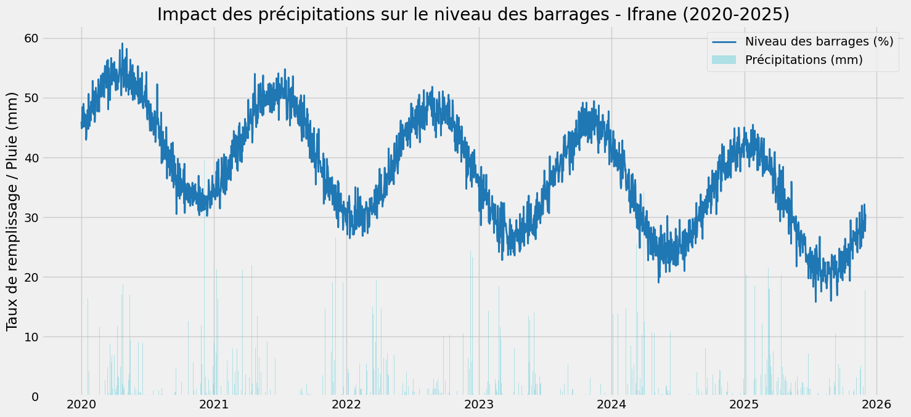
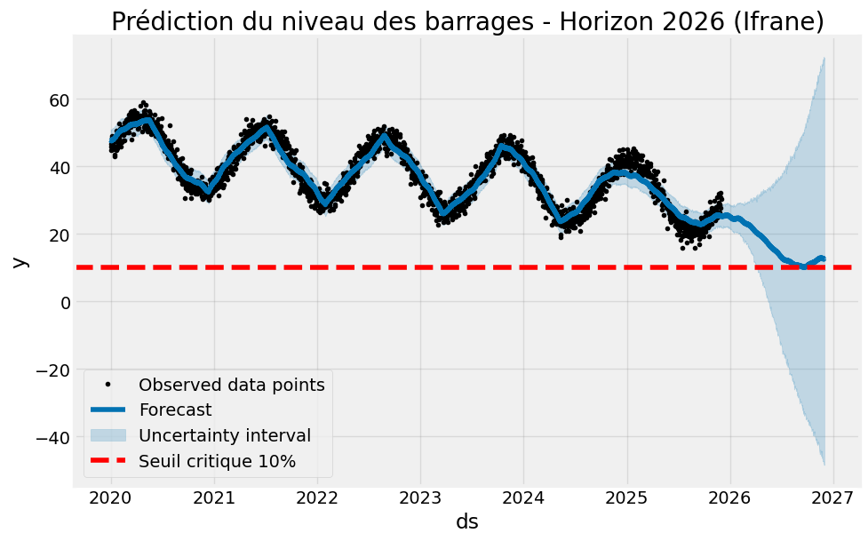

# 🌧️ Morocco Water Resilience 2026 – Ifrane

## 🇲🇦 Contexte

Le Maroc fait face à un stress hydrique croissant, avec une baisse régulière du niveau des barrages et une forte variabilité des précipitations.  
Ce projet utilise la ville d’Ifrane comme **proxy climatique** pour analyser le lien entre pluie et niveau des barrages, et projeter le risque de stress hydrique à l’horizon 2026.

---

## 🎯 Objectif

Analyser le lien entre les précipitations et un niveau de barrage simulé pour une région climatique clé (Ifrane), puis prédire l’évolution de ce niveau avec un modèle de séries temporelles (**Prophet**) afin d’illustrer un scénario de stress hydrique.

---

## 📊 Aperçu visuel des résultats

### Impact des précipitations sur le niveau des barrages (2020–2025)



Ce graphique montre l’évolution du niveau simulé des barrages (courbe) et des précipitations quotidiennes (barres) pour la zone climatique d’Ifrane entre 2020 et 2025.

### Prédiction du niveau des barrages – Horizon 2026



Le modèle Prophet projette l’évolution du niveau des barrages jusqu’en 2026, avec un **seuil critique de 10 %** matérialisé par une ligne rouge en pointillé.

---

## 📁 Contenu du projet

- `Water_Resilience_Morocco_2026.ipynb`  
  Notebook complet : récupération des données météo, construction du signal de niveau de barrage, visualisations, indicateurs et prédiction 2026.

- `impact_pluie_niveau_barrages_ifrane.png`  
  Graphique pluie vs niveau des barrages (2020–2025).

- `prediction_barrages_ifrane_2026.png`  
  Graphique de la projection du niveau des barrages jusqu’en 2026.

---

## 🧪 Méthodologie

1. **Données météo réelles**  
   - Récupération des précipitations quotidiennes et de la température moyenne (2020–2025) pour Ifrane via une API météo ouverte.

2. **Construction du signal de niveau de barrage**  
   - Composante saisonnière (cycles annuels de remplissage / vidange).  
   - Tendance à la baisse sur plusieurs années pour représenter le stress hydrique.  
   - Bruit aléatoire pour refléter la variabilité naturelle.

3. **Analyse exploratoire**  
   - Visualisation conjointe pluie / niveau.  
   - Calcul d’indicateurs clés : moyenne, minimum, maximum du niveau, cumul des précipitations, corrélation pluie (30 jours cumulés) / niveau.

4. **Modélisation & prédiction**  
   - Entraînement d’un modèle **Prophet** sur le niveau simulé.  
   - Projection du niveau des barrages sur 365 jours supplémentaires (année 2026).  
   - Comparaison au seuil critique de 10 % pour mettre en évidence un scénario de stress hydrique.

---

## 📈 Indicateurs clés (Ifrane 2020–2025)

- Niveau moyen des barrages : **37,6 %**  
- Niveau minimum observé : **≈ 15,8 %**  
- Niveau maximum observé : **≈ 59,1 %**  
- Total des précipitations : **≈ 3 253 mm**  
- Corrélation pluie (30 jours cumulés) / niveau : **≈ -0,05**

Ces résultats illustrent une **tendance générale à la baisse** du niveau des barrages malgré un volume de précipitations significatif, ce qui reflète la pression croissante sur la ressource en eau.

---

## 🚀 Comment reproduire l’analyse

1. **Cloner le repository**

```
git clone https://github.com/YOUSSEF-BT/Morocco-Water-Resilience-2026.git
cd Morocco-Water-Resilience-2026
Créer un environnement et installer les dépendances principales

pip install pandas matplotlib prophet requests
Lancer le notebook

jupyter notebook Water_Resilience_Morocco_2026.ipynb
Exécuter les cellules dans l’ordre pour reconstruire les graphiques et les indicateurs.
```
🛠️ Stack technique

-Python
-Pandas
-NumPy
-Matplotlib
-Prophet
-API météo (données ouvertes)

👤 Auteur

Youssef Bouzit

Étudiant Cycle Ingénieur Data Science – SUP MTI Rabat
